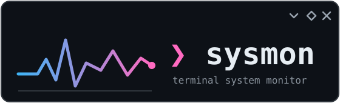

<p align="center">
  
</p>

Background system-monitoring daemon + interactive TUI for Linux. The daemon
samples CPU, memory, per-process stats, and **every hardware sensor the
kernel exposes** each second, stores history in SQLite, and streams live
samples over a unix socket to any attached client. The TUI is just a
client — close it (or the whole terminal) and the daemon keeps collecting.

- Single static binary, zero runtime dependencies — runs on any distro
  (glibc, musl/Alpine, …) and any architecture (x86_64, ARM64/Snapdragon,
  ARMv7, RISC-V)
- Vendor-agnostic hardware support: no lm-sensors, no vendor tools needed
- systemd user service included, but works without systemd too

## Supported hardware

sysmon reads the kernel's standardized sensor interfaces rather than
vendor-specific tools, so anything with a Linux driver shows up
automatically — including hotplugged USB devices:

| Interface | What it covers |
|---|---|
| `/sys/class/hwmon` | CPU temps (Intel coretemp, AMD k10temp, ARM SoC drivers), GPU temps/fans/power (amdgpu, nouveau), NVMe drives, SATA HDDs/SSDs (`drivetemp`), DDR5 RAM (spd5118), motherboard/EC chips (fans, voltages, currents, power), USB hwmon devices |
| `/sys/class/thermal` | ACPI & SoC thermal zones — the primary temp source on ARM/Snapdragon devices |
| `/sys/class/power_supply` | Batteries (charge, wattage, temp), AC/USB-PD adapters, even wireless peripherals that report charge |
| `/sys/class/drm` | GPU utilization + VRAM (amdgpu), GT frequency (Intel i915/xe) — any PCI GPU by vendor id |
| `/sys/bus/iio` | Environmental sensors: temperature, humidity, pressure, ambient light (tablets, ARM boards, USB dongles) |
| `nvidia-smi` | Proprietary NVIDIA driver: utilization, temp, power, fan, VRAM (auto-detected, skipped if absent) |

Everything is re-enumerated every sample, so plugging in a USB drive or
sensor makes it appear live in the TUI; unplugging removes it.

**SATA drive temps**: load the `drivetemp` kernel module (kernel ≥ 5.6):
`modprobe drivetemp`, persist with `echo drivetemp | sudo tee /etc/modules-load.d/drivetemp.conf`.
NVMe drives need nothing.

## Install

From a [release](../../releases): download the tarball for your
architecture, then:

```bash
tar xzf sysmon_*.tar.gz && cd sysmon_*
install -Dm755 sysmon ~/.local/bin/sysmon
```

From source (Go ≥ 1.22):

```bash
make install       # binary -> ~/.local/bin, unit -> ~/.config/systemd/user
```

### Run in the background

With systemd (any systemd distro — Arch, Fedora, Debian, Ubuntu, openSUSE…):

```bash
systemctl --user enable --now sysmon.service
```

Without systemd (Alpine, Void, Gentoo/OpenRC, containers):

```bash
sysmon daemon --detach     # forks, detaches from the terminal
# or supervise `sysmon daemon` with OpenRC/runit/s6 as a user service
```

## Usage

```bash
sysmon tui      # attach the interactive UI (q to quit — daemon keeps running)
sysmon tail     # print live samples as JSON lines (pipe into jq etc.)
sysmon daemon   # run the collector in the foreground
```

### TUI keys

| Key | Action |
|---|---|
| `tab` / `shift+tab` | switch tabs (overview / focus / sensors / logs) |
| `↑` `↓` | select a process/sensor to graph, or scroll logs |
| `/` | edit the logs filter, `enter` applies, `esc` cancels |
| `r` | re-run the logs query |
| `q` / `ctrl+c` | quit the TUI (daemon unaffected) |

### Logs filter syntax

Free text in one line, e.g. `firefox cpu>20 1h`:

- plain words — substring match on process name
- `cpu>N` — only rows with CPU ≥ N%
- a duration (`15m`, `2h`) — only rows newer than that

## Config

`~/.config/sysmon/config.yaml` (hot-reloaded by the daemon, no restart
needed) — see [config.example.yaml](config.example.yaml):

```yaml
focus:                    # process names to track (substring match);
  - firefox               # empty = top 10 by CPU
sample_interval_ms: 1000
retention_days: 7         # prune history older than this (-1 = keep forever)
```

## Paths

- history DB: `~/.local/share/sysmon/sysmon.db` — query it directly, e.g.
  `sqlite3 ~/.local/share/sysmon/sysmon.db "SELECT * FROM sensor_samples WHERE chip LIKE 'gpu%' AND ts > unixepoch()-3600"`
- live socket: `$XDG_RUNTIME_DIR/sysmon.sock`
- daemon logs: `journalctl --user -u sysmon.service`

## Development

```bash
make build     # static binary for the host
make test
make cross     # linux/{amd64,arm64,armv7,riscv64} into dist/
```

Releases are cut by tagging (`git tag v0.1.0 && git push --tags`) — the
GitHub Actions workflow builds and publishes binaries for all
architectures via goreleaser.

## License

[PolyForm Noncommercial 1.0.0](LICENSE) — in plain English:

- **You can** download, use, study, modify, and share sysmon (and your
  modified versions) freely, for any noncommercial purpose: personal use,
  hobby projects, research, education, charities, public institutions.
- **You cannot** sell sysmon, or sell anything built from it —
  adaptations, extensions, forks, or products that incorporate it — or
  otherwise use it for commercial purposes.

If you redistribute it, keep the `Required Notice` and license with it.
